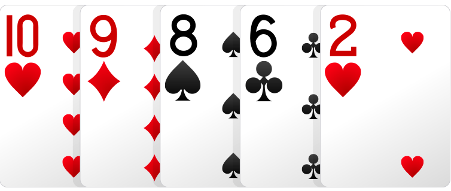
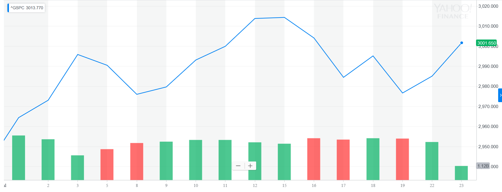
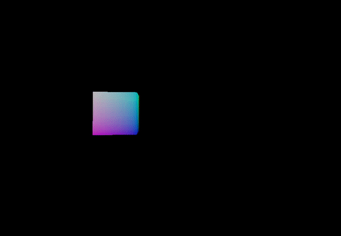
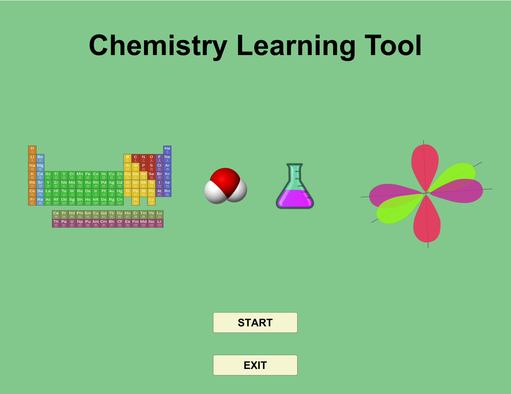
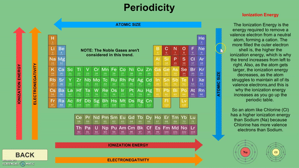
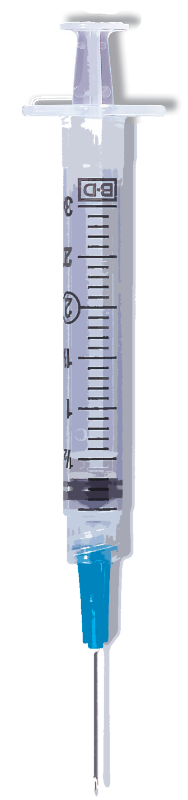
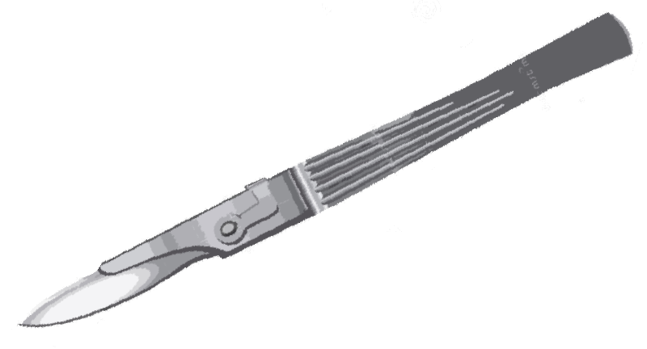
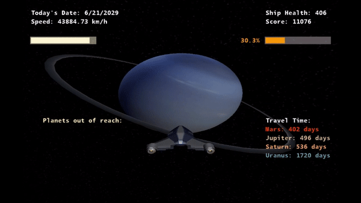

__NOTE THIS IS STILL A WORK IN PROGRESS! WILL CONTINUE UPDATING THIS PORTFOLIO. I WILL BE CONTINUOUSLY UPDATING THIS PAGE AS I CREATE NEW PROJECTS IN THE FUTURE.__

# Daniel's Personal Portfolio
## About Me and My Work
Hello! My name is Ikechukwu Daniel Adebi, although I personally go by Daniel, and I am a member of MIT's class of 2022, majoring in Computer Science and Physics. This is my portfolio of projects I've worked on over the years. All of my work on this portfolio spans from 2016, all the way up til today, but I have been programming since 2013, when I was in eighth grade. In this portfolio, however, I will only be describing my work from 2016 to present day. 

### List of Projects 

|Project Name | Language | Brief Description | Duration |
|:-----------:|:----------:|------------|:-----------:|
|[Quantum Machine Learning Model](#Quantum-Machine-Learning-Model)| Python | A support vector machine that runs on a virtual quantum system. This was my side project for my internship at IBM. | June 2019 - August 2019 |
|[Poker Hand Classifier](#Poker-Hand-Classifier) | Python | Neural network that classifies different poker hands.| July 2019 |
|[Stock Predictor](#Stock-Predictor) | Python | Machine Learning model that predicts stock prices.| June 2019 | 
|[SSA Game Engine](#SSA-Game-Engine) | Java | 3D Game Engine I developed from scratch for my Independent Study in high school. (SSA = Simulation Software Analysis) | January 2018 - April 2018 |
|[Chemistry Learning Tool](#Chemistry-Learning-Tool) | C# (Unity) | Chemistry Learning Tool developed in Unity to teach high school students the fundamentals of chemistry. | January 2017 - May 2017 |
|[Surgery Learning Tool](#Surgery-Learning-Tool) | C# (KINECT) | Program that uses the KINECT camera to track students hand movements to teach them how to perform surgeries. | January 2017 - May 2017 |
|[Expedition of the Cosmos](#Expedition-of-the-Cosmos) | C# (XNA) | Video game that simulates motion from all planets from Earth to Neptune. Motion data modeled using Wolfram Mathematica. | September 2016 - December 2016 |

## Projects 
### Quantum Machine Learning Model 
 

    

#### Description
This program is a quantum support vector machine that runs on IBM's QASM simulator, where QASM is a programming language for formally defining a quantum systems. This model takes in breast cancer data from the years 1958-1970 and determines whether or not someone lived more than 5 years after they have been diagnosed. This program uses the Qiskit library to run, and the survival date comes from UCI's machine learning repository.
#### Reason For Develepment
I received this project as an assignment during my time interning with IBM as a software developer. I explained to them that I had interest in learning more about how machine learning works, as well as my interest in physics (particularly quantum physics), and as a result, I got the opportunity to learn from people on the IBM Q team and work on this project.
#### Room For Improvement
The amount of data I used was very small (only a bit more than 300 datapoints), so my model was not very accurate (~70% accuracy was the best I achieved). Despite the amount of research I put into this project, I still had very little experience with quantum computing and almost no experience with machine learning going into this project, but I ended up learning a lot about both fields through this project so I'm pretty happy with my result.

[Back to Projects](#List-of-Projects)

### Poker Hand Classifier 

 

#### Description 
This program is a neural network that is able to identify poker hands with over 99% accuracy (best model was 99.62% accurate). I used the UCI machine learning repository to gather data to train this model, and ended up using over 1,000,000 data points total to train and test the data. 
#### Reason For Development 
This is was the first time I created a neural network without following any tutorials online, and I was also curious to see how neural networks go about classifying different sets of numbers, and I found this poker hand classifier as an easy way to do so. 
#### Room For Improvement
While this model was generally very accurate, and accurate for more common hands (i.e. one pair, two pairs, etc.), this model was much less accurate for more rare hands like four of a kind, or a straight flush, or even just straights in general. This is most likely because the dataset I used was not evenly distributed, so if I were to make this project again, I would prolly try and get an evenly distributed amount of each hand type, so my neural network could classify the rarer hands more accurately. 

[Back to Projects](#List-of-Projects)

### Stock Predictor 

   &nbsp;&nbsp;&nbsp;&nbsp;&nbsp;&nbsp;&nbsp;&nbsp;  

#### Description
This is a machine learning model that takes in the prices of each stock in the S&P 500 and by using a voting classifier, predicts whether the prices will rise or fall and by how much. It can also determine whether or not you should buy, sell, or hold a stock for a certain timespan (default is 7 days) provided by the user. Credits to sentdex (youtube channel) and Yahoo Finance for providing me the resources and information I needed for this project.
#### Reason For Development 
Well, besides trying to get rich fast, I wanted to learn how to work with and process time-series data. While I don't have the strongest interest in finance, I do find stocks to be rather interesting, so I decided to see what I could do trying to predict them. 
#### Room For Improvement
This model was rather difficult to determine how accurate it was, considering that it decided to hold stock shares for the majority of the timeline. And when the model made the decision to buy or sell, it usually made the right choice, but there were occasions where it would miss major profits, and some stocks resulted in negative returns altogether. If I could remake this model, I would probably focus on a few stocks (or even just one) at a time, and train the model to maximize returns for those stocks only rather than trying to go for 500 at once.

[Back to Projects](#List-of-Projects)

### SSA Game Engine

  &nbsp;&nbsp;&nbsp;&nbsp;&nbsp;   &nbsp;&nbsp;&nbsp;&nbsp;&nbsp; 

#### Description
I developed a 3D game engine for an independent study I did in my senior year of high school. I used various youtube tutorials to help me along the way. The engine is capable of simulating real world physics and is also highly customizable. 
#### Reason For Develepment
The independent study was called "Simulation Software Analysis", or SSA, because for the entire year, I studied different types of simulation software. I decided to make a game engine in particular because at the time, most of my programming was for video game purposes, and I wanted to learn more about the environments I would be developing in. 
#### Room For Improvement
I feel that I could have made the engine more intuitive and simpler to use, because as of right now, while I feel that I did a pretty good job at structuring and organizing my code, I may have condensed processes like rendering to a point where there isn't much flexibility or freedom to change much about its process.

[Back to Projects](#List-of-Projects)

### Chemistry Learning Tool

  
 

   &nbsp;&nbsp;&nbsp;&nbsp;&nbsp; 

#### Description
The Chemistry Learning Tool is a program I developed to teach high school students introductory level chemistry. It covers topics like atomic structure, periodicity, bonding, and others. This tool helped sophomores and juniors in my grade study for their exams.
#### Reason For Develepment
In high school, I found chemistry to be a pretty easy subject for me to learn. But I found that many of my classmates struggled in class for various reasons, whether it was because they weren't able to remember all of the correct electron configurations, or if they just could not figure out how different atoms bonded with each other. So I developed this program to help my classmates and friends better understand the material. 
#### Room For Improvement
A lot of the information in this program is just text listed in paragraph form, rather than in clearer and more concise bullet points or sections. Shorter text would also allow for students to better absorb the information they are provided, rather than being forced to read through texts that's similar to the textbooks. I also was not able to cover all topics covered in our Chemistry classes, so I could have covered more specific topics like different kinds of chemical reactions, and displayed animations or visuals of these concepts. 

[Back to Projects](#List-of-Projects)

### Surgery Learning Tool

 &nbsp;&nbsp;&nbsp;&nbsp;&nbsp;&nbsp;&nbsp;  &nbsp;&nbsp;&nbsp;&nbsp;&nbsp;&nbsp;&nbsp;&nbsp;&nbsp;&nbsp;&nbsp;&nbsp;&nbsp;&nbsp;&nbsp;&nbsp;&nbsp;&nbsp;   &nbsp;&nbsp;&nbsp;&nbsp;&nbsp; 

#### Description

#### Reason For Develepment

#### Room For Improvement

[Back to Projects](#List-of-Projects)

### Expedition of the Cosmos

  
 

   &nbsp;&nbsp;&nbsp;&nbsp;&nbsp; 

#### Description

#### Reason For Develepment

#### Room For Improvement

[Back to Projects](#List-of-Projects)

