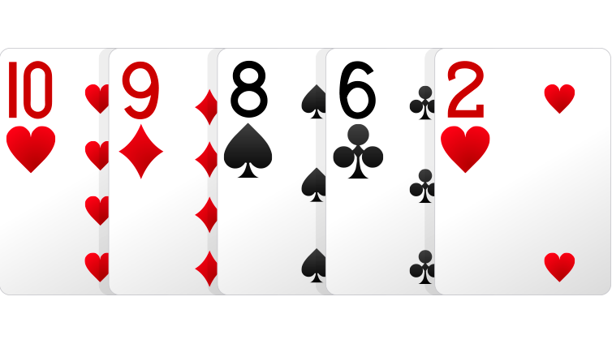

__NOTE THIS IS STILL A WORK IN PROGRESS! WILL CONTINUE UPDATING THIS PORTFOLIO. I WILL BE CONTINUOUSLY UPDATING THIS PAGE AS I CREATE NEW PROJECTS IN THE FUTURE.__

# Daniel's Personal Portfolio
## About Me
Hello! My name is Ikechukwu Daniel Adebi, and I am a member of MIT's class of 2022, majoring in Computer Science and Physics. This is my portfolio of projects I've worked on over the years. All of my work on this github spans from 2017, all the way up til today, but I have been programming since 2013, when I was in eighth grade. Most of my work from that time has been lost, so for those projects, I'll simply describe what their purposes were and why I made them. 

### List of Projects 

|Project Name | Language | Brief Description |
|:-----------:|:----------:|------------|
|[Poker Hand Classifier](#Poker-Hand-Classifier) | Python | Neural network that classifies different poker hands.|
|[Stock Predictor](#Stock-Predictor) | Python | Machine Learning model that predicts stock prices.|

## Projects 

### Poker Hand Classifier 
_Completed in July 2019_

 

#### Description 
This program is a neural network that is able to identify poker hands with over 99% accuracy (best model was 99.62% accurate). I used the UCI machine learning repository to gather data to train this model, and ended up using over 1,000,000 data points total to train and test the data. 
#### Reason For Development 
This is was the first time I created a neural network without following any tutorials online, and I was also curious to see how neural networks go about classifying different sets of numbers, and I found this poker hand classifier as an easy way to do so. 
#### Room For Improvement
While this model was generally very accurate, and accurate for more common hands (i.e. one pair, two pairs, etc.), this model was much less accurate for more rare hands like four of a kind, or a straight flush, or even just straights in general. This is most likely because the dataset I used was not evenly distributed, so if I were to make this project again, I would prolly try and get an evenly distributed amount of each hand type, so my neural network could classify the rarer hands more accurately.

### Stock Predictor 
_Completed in June 2019_
#### Description
This is a machine learning model that takes in the prices of each stock in the S&P 500 and by using a support vector machine, predicts whether the prices will rise or fall and by how much. It can also determine whether or not you should buy, sell, or hold a stock for a certain timespan (default is 7 days) provided by the user. Credits to sentdex (youtube channel) and yahoo finance for providing me the resources and information I needed for this project.
#### Reason For Development 
Well, besides trying to get rich fast, I wanted to learn how to work with and process time-series data. While I don't have the strongest interest in finance, I do find stocks to be rather interesting, so I decided to see what I could do trying to predict them. 
#### Room For Improvement
This model was rather difficult to determine how accurate it was, considering that it decided to hold stock shares for the majority of the timeline. And when the model made the decision to buy or sell, it usually made the right choice, but there were occasions where it would miss major profits, and some stocks resulted in negative returns altogether. If I could remake this model, I would probably focus on a few stocks (or even just one) at a time, and train the model to maximize returns for those stocks only rather than trying to go for 500 at once.

